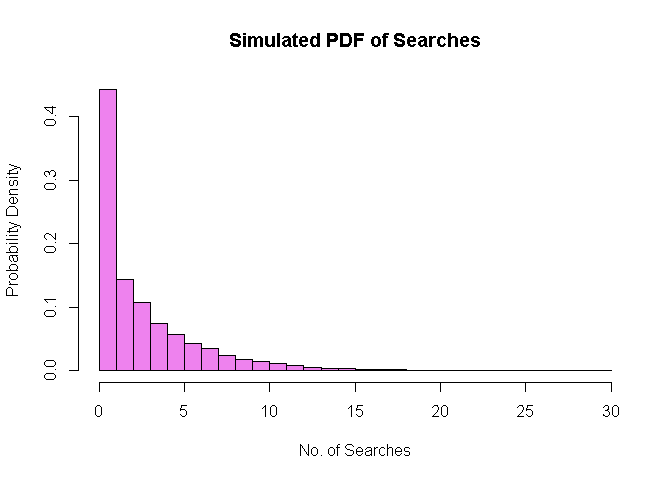

Number 3
================
Cuerdo, NHA., Morillo, JMS
2024-03-18

# Number 3

By generating 10,000 searches in R, carry out a simulation experiment
for a search engine going through a list of sites for a given key
phrase, until the key phrase is found. You should allow your program to
input the probability p that any site will contain the key phrase.

Plot the simulated pdf and calculate its mean and variance, and Obtain
the simulated conditional distribution of searches when three searches
have been carried out without success. Calculate its mean and variance,
and satisfy yourself that they are equivalent to the simulated
distribution of the complete set. As test data assume each site has a
60% chance of containing the key phrase. To satisfy yourself that the
Markov memoryless property holds, obtain estimates of:

P(X=4 \| X \> 3) and P(X=1) P(X= 5 \| X \> 3) and P(X=2)

## With sample probability input

``` r
p <- 25 / 100 # set the probability manually

simulate_search <- function(p, search_num) {
  search_sim <- rgeom(search_num, p)
  return(search_sim)
}

mean_var <- function(data) {
  mean_val <- mean(data)
  var_val <- var(data)
  return(list(mean = mean_val, variance = var_val))
  
}

search_num <- 10000
search_sim <- simulate_search(p, search_num)

hist(search_sim, breaks = max(search_sim),
     freq = FALSE, main = "Simulated PDF of Searches",
     xlab = "No. of Searches", 
     ylab = "Probability Density",
     col = "violet")
```

<!-- -->

``` r
stat_complete <- mean_var(search_sim)
cat("\nMean of Complete set: ", stat_complete$mean, "\n")
```

    ## 
    ## Mean of Complete set:  2.9554

``` r
cat("\nVariance of Complete set: ", stat_complete$variance, "\n")
```

    ## 
    ## Variance of Complete set:  11.59077

``` r
condi_search <- search_sim[search_sim > 3]

condi_stats <- mean_var(condi_search)
cat("\nMean of Conditioned set: ", condi_stats$mean, "\n")
```

    ## 
    ## Mean of Conditioned set:  7.02343

``` r
cat("\nVariance of Conditioned set: ", condi_stats$variance, "\n")
```

    ## 
    ## Variance of Conditioned set:  11.19346

``` r
p4_3 <-sum(search_sim == 4) / sum(search_sim > 3)
p1 <- sum(search_sim == 1) / length(search_sim)

cat("\nP(X = 4 | X > 3: ", p4_3, "\n")
```

    ## 
    ## P(X = 4 | X > 3:  0.2424341

``` r
cat("\nP(X = 1)", p1, "\n")
```

    ## 
    ## P(X = 1) 0.1891

``` r
p5_3 <-sum(search_sim == 5) / sum(search_sim > 3)
p2 <- sum(search_sim == 2) / length(search_sim)

cat("\nP(X = 5 | X > 3: ", p5_3, "\n")
```

    ## 
    ## P(X = 5 | X > 3:  0.1858119

``` r
cat("\nP(X = 2)", p2, "\n")
```

    ## 
    ## P(X = 2) 0.1432

## Number three without sample input

\*\*\* this is the code prior converting to r markdown, from the R
script. \*\*\*

``` r
cat("Enter the probability")
```

    ## Enter the probability

``` r
p <-as.numeric(stdin()) / 100

simulate_search <- function(p, search_num) {
  search_sim <- rgeom(search_num, p)
  return(search_sim)
}

mean_var <- function(data) {
  mean_val <- mean(data)
  var_val <- var(data)
  return(list(mean = mean_val, variance = var_val))
  
}

search_num <- 10000
search_sim <- simulate_search(p, search_num)
```

    ## Warning in rgeom(search_num, p): NAs produced

``` r
breaks <- max(search_sim) - min(search_sim) + 1
# hist(search_sim, breaks = breaks,
  #   freq = FALSE, main = "Simulated PDF of Searches",
   #  xlab = "No. of Searches", 
    # ylab = "Probability Density",
    # col = "violet") */


stat_complete <- mean_var(search_sim)
cat("\nMean of Complete set: ", stat_complete$mean, "\n")
```

    ## 
    ## Mean of Complete set:  NA

``` r
cat("\nVariance of Complete set: ", stat_complete$variance, "\n")
```

    ## 
    ## Variance of Complete set:  NA

``` r
condi_search <- search_sim[search_sim > 3]

condi_stats <- mean_var(condi_search)
cat("\nMean of Conditioned set: ", condi_stats$mean, "\n")
```

    ## 
    ## Mean of Conditioned set:  NA

``` r
cat("\nVariance of Conditioned set: ", condi_stats$variance, "\n")
```

    ## 
    ## Variance of Conditioned set:  NA

``` r
p4_3 <-sum(search_sim == 4) / sum(search_sim > 3)
p1 <- sum(search_sim == 1) / length(search_sim)

cat("\nP(X = 4 | X > 3: ", p4_3, "\n")
```

    ## 
    ## P(X = 4 | X > 3:  NA

``` r
cat("\nP(X = 1)", p1, "\n")
```

    ## 
    ## P(X = 1) NA

``` r
p5_3 <-sum(search_sim == 5) / sum(search_sim > 3)
p2 <- sum(search_sim == 2) / length(search_sim)

cat("\nP(X = 5 | X > 3: ", p5_3, "\n")
```

    ## 
    ## P(X = 5 | X > 3:  NA

``` r
cat("\nP(X = 2)", p2, "\n")
```

    ## 
    ## P(X = 2) NA
